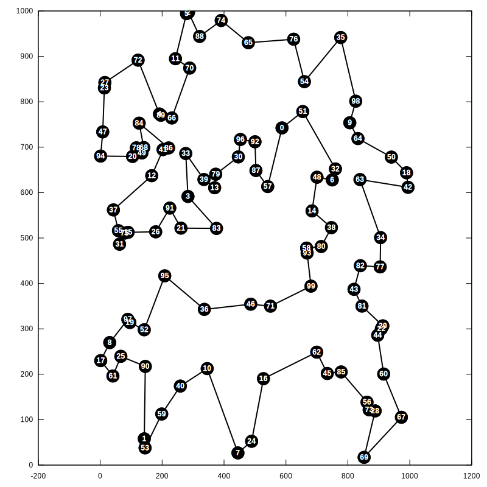
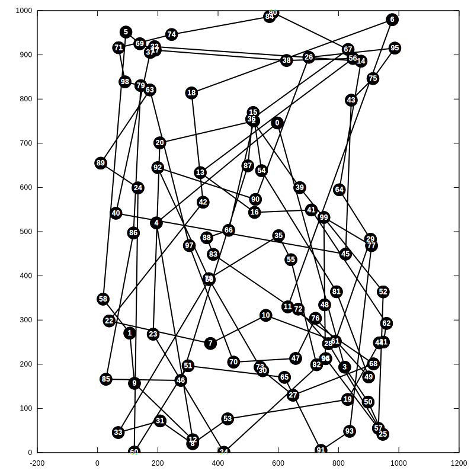
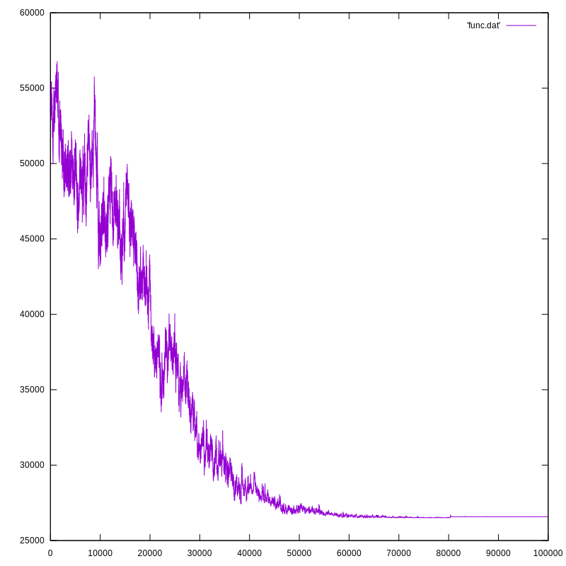
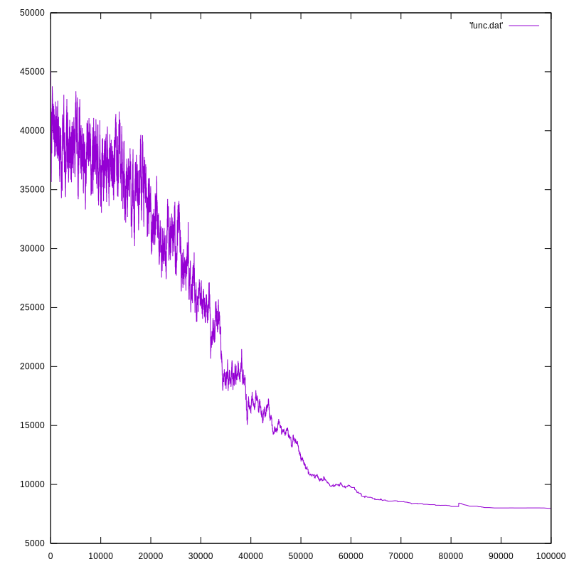
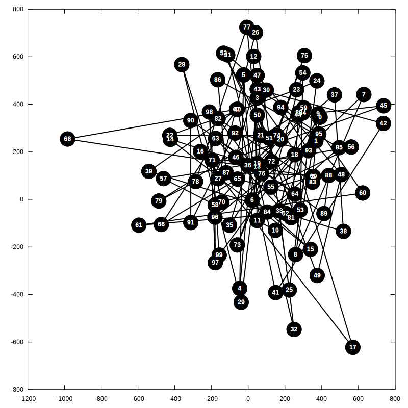
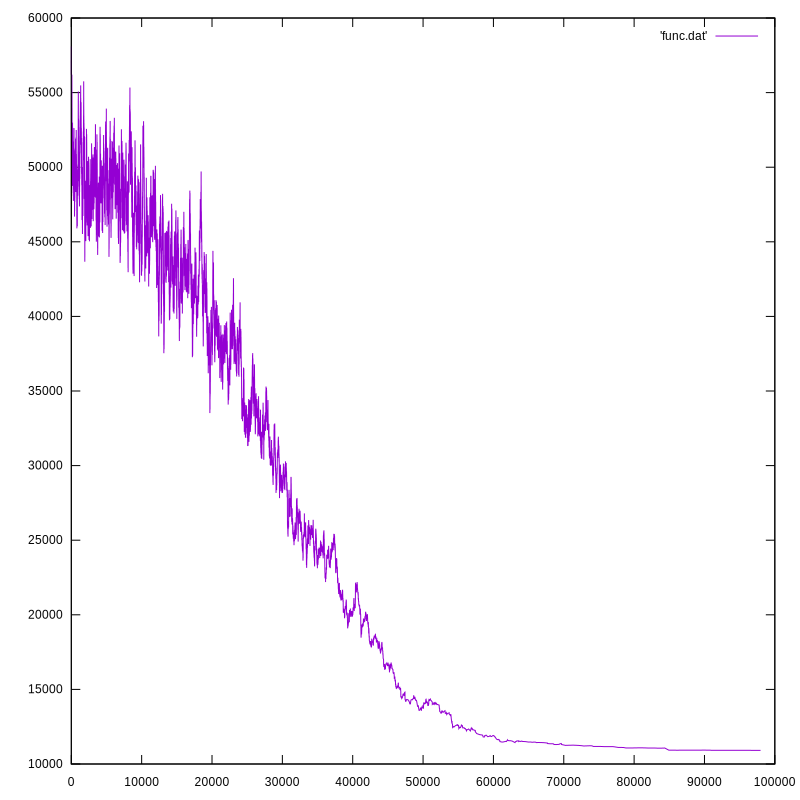
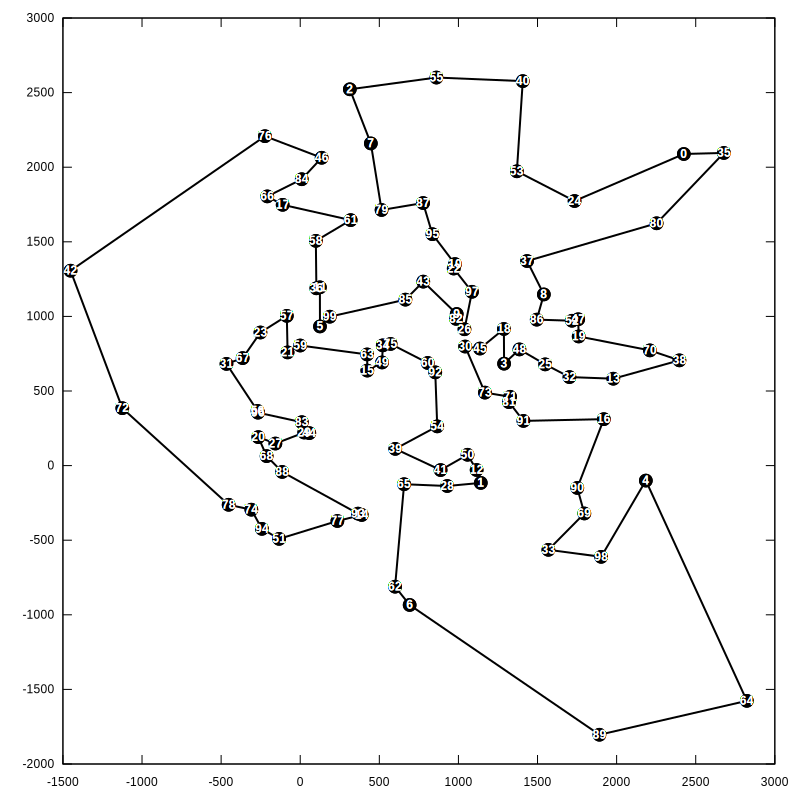
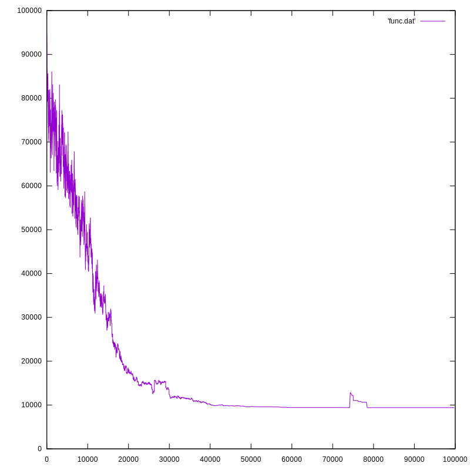

# Metody Obliczeniowe w Nauce i Technice
## Laboratorium 4 - Symulowane wyżarzanie

### **1.** TSP
Wygeneruj chmurę n losowych punktów w 2D, a następnie zastosuj algorytm symulowanego
wyżarzania do przybliżonego rozwiązania problemu komiwojażera dla tych punktów.  
a) Przedstaw wizualizację otrzymanego rozwiązania dla 3 różnych wartości n oraz 3
różnych układów punktów w 2D (rozkład jednostajny, rozkład normalny z czterema
różnymi grupami parametrów, dziewięć odseparowanych grup punktów).  
b) Zbadaj wpływ sposobu generacji sąsiedniego stanu (consecutive swap vs. arbitrary
swap) oraz funkcji zmiany temperatury na zbieżność procesu optymalizacji.  
c) Przedstaw wizualizację (saoptimset) działania procedury minimalizującej funkcję
celu. 

### **1.** Rozwiązanie
Moje rozwiązanie składa się z takich funkcji jak:
- distance - która liczy odległość, korzystając z metryki Euklidesowej
- toSwapped2opt - zamienia dwie krawędzie miejscami (kopiuje tablicę do 1. wierzhołka, następnie odwraca częśc tablicy pomiędzy 1. i 2. wierzchołkiem, po czym kopiuje do końca bez zmian)
- calculateLength - oblicza długość wszystkich krawędzi
- getNextNeighbor - zwraca toSwapped2opt zamieniając dany wierzchołek i jego następnego sąsiada
- getRandomNeighbor - zwraca toSwapped2opt od dwóch losowuch wierzchołków
- annealing - wykonuje symulowane wyżarzanie
- visualizeGraph - wizualizuje graf i zapisuje go do pliku
- *_graph - 3 funkcje, które zwracają stworzony graf w zależności od nazwy(\*)

#### Funkcja zad1 bierze argumenty: rodzaj grafu, temperatura początkowa, zmiana temperatury, maksymalne ilość powtórzeń, czy losowy sąsiad, wielkość wierzchołka na rysunku.

##### **1.** Rozkład jednostajny, 1414.0, 0.99993, 100000.0, losowy sąsiad, 20.0

##### **2.** Rozkład jednostajny, 1414.0, 0.99993, 100000.0, następny wierzchołek w grafie, 20.0

##### **3.** Rozkład noramlny, 1414.0, 0.99993, 100000.0, losowy sąsiad, 40.0

##### **4.** Rozkład normalny, 1414.0, 0.99993, 100000.0, true, 40.0

##### **5.** Rozkład normalny, 1414.0, 0.99993, 100000.0, true, 40.0

##### **6.** Rozkład normalny, 1414.0, 0.99993, 100000.0, true, 40.0

##### **7.** 9 osobnych klastrów, 1414.0, 0.9999, 100000.0, true, 40.0

### **2.** Obraz binarny
Wygeneruj losowy obraz binarny o rozmiarze n×n i wybranej gęstości δ czarnych punktów δ = 0.1, 0.3, 0.4. Korzystając z różnego typu sąsiedztwa (4-sąsiadów, 8-sąsiadów, 8-16-sąsiadów) zaproponuj funkcję energii (np. w bliskiej odległości te same kolory przyciągają się, a w dalszej odpychają się, funkcja energii może być również adaptacją modelu Isinga) i dokonaj jej minimalizacji za pomocą algorytmu symulowanego wyżarzania. W jaki sposób można generować stany sąsiednie? Jak różnią się uzyskane wyniki w zależności od rodzaju sąsiedztwa, wybranej funkcji energii i szybkości spadku temperatury?

### **2.** Rozwiązanie

W moim rozwiązaniu przyjąłem rozmiar 300 x 300 bitów, napisałem funkcje dla 8 różnych sąsiedztw, a jako funckję energii zaadaptowałem model Isinga. Stan sąsiedni generuję zamieniając miejscami dwa bity (oczywiście wtedy tylko kiedy są one różne, bo gdy są takie same energia się nie zmienia).

#### Funkcja zad2 bierze argumenty: gęstość, temperatura początkowa, zmiana temperatury, maksymalne ilość powtórzeń, rodzaj sąsiedztwa

##### **1.1.** 0.1, 5000, 0.999995, 2 000 000, mały krzyżyk

##### **1.2.** 0.1, 5000, 0.999995, 2 000 000, mały krzyżyk

##### **1.3.** 0.1, 5000, 0.999995, 2 000 000, mały krzyżyk

##### **2.1.** 0.1, 5000, 0.999995, 2 000 000, mały x

##### **2.2.** 0.1, 5000, 0.999995, 2 000 000, mały x

##### **2.3.** 0.1, 5000, 0.999995, 2 000 000, mały x

##### **3.1.** 0.1, 5000, 0.999995, 2 000 000, x

##### **3.2.** 0.1, 5000, 0.999995, 2 000 000, x

##### **3.3.** 0.1, 5000, 0.999995, 2 000 000, x

##### **4.1.** 0.1, 5000, 0.999995, 2 000 000, duży x

##### **4.2.** 0.1, 5000, 0.999995, 2 000 000, duży x

##### **4.3.** 0.1, 5000, 0.999995, 2 000 000, duży x

##### **5.1.** 0.1, 5000, 0.999995, 2 000 000, duży krzyżyk

##### **5.2.** 0.1, 5000, 0.999995, 2 000 000, duży krzyżyk

##### **5.3.** 0.1, 5000, 0.999995, 2 000 000, duży krzyżyk

##### **6.1.** 0.1, 5000, 0.999995, 2 000 000, pionowa kreska nad punktem

##### **6.2.** 0.1, 5000, 0.999995, 2 000 000, pionowa kreska nad punktem

##### **6.3.** 0.1, 5000, 0.999995, 2 000 000, pionowa kreska nad punktem

##### **7.1.** 0.1, 5000, 0.999995, 2 000 000, ukośnik

##### **7.2.** 0.1, 5000, 0.999995, 2 000 000, ukośnik

##### **7.3.** 0.1, 5000, 0.999995, 2 000 000, ukośnik

##### **8.1.** 0.1, 5000, 0.999995, 2 000 000, losowy kształt

##### **8.2.** 0.1, 5000, 0.999995, 2 000 000, losowy kształt

##### **8.3.** 0.1, 5000, 0.999995, 2 000 000, losowy kształt

### 3. Sudoku
Napisz program poszukujący rozwiązania łamigłówki Sudoku za pomocą symulowanego
wyżarzania. Plansza 9×9 ma zostać wczytana z pliku tekstowego, w którym pola puste
zaznaczone są znakiem x. Jako funkcję kosztu przyjmij sumę powtórzeń cyfr występujących
w wierszach bloku 9 × 9, kolumnach bloku 9 × 9 oraz blokach 3 × 3. Zaproponuj
metodę generacji stanu sąsiedniego. Przedstaw zależność liczby iteracji algorytmu od
liczby pustych miejsc na planszy. Czy Twój program jest w stanie znaleźć poprawne
rozwiązanie dla każdej z testowanych konfiguracji wejściowych?